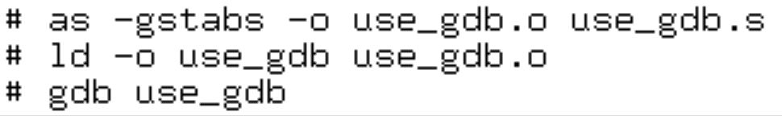
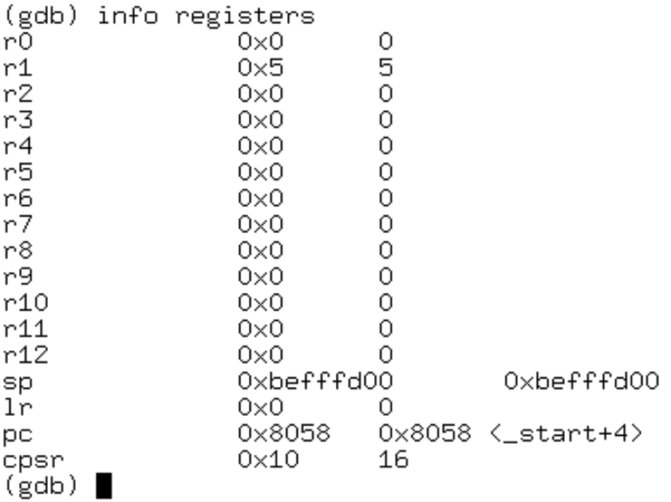
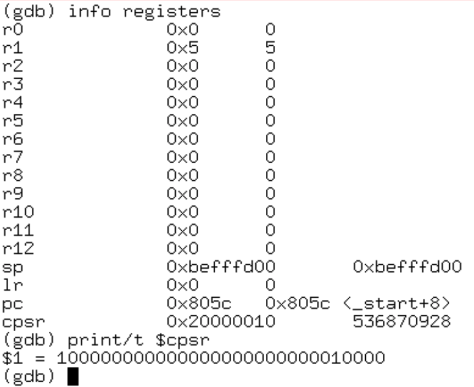
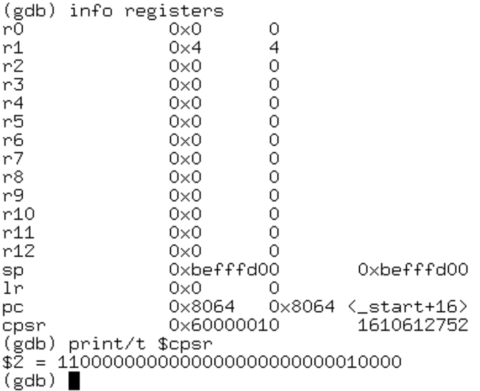
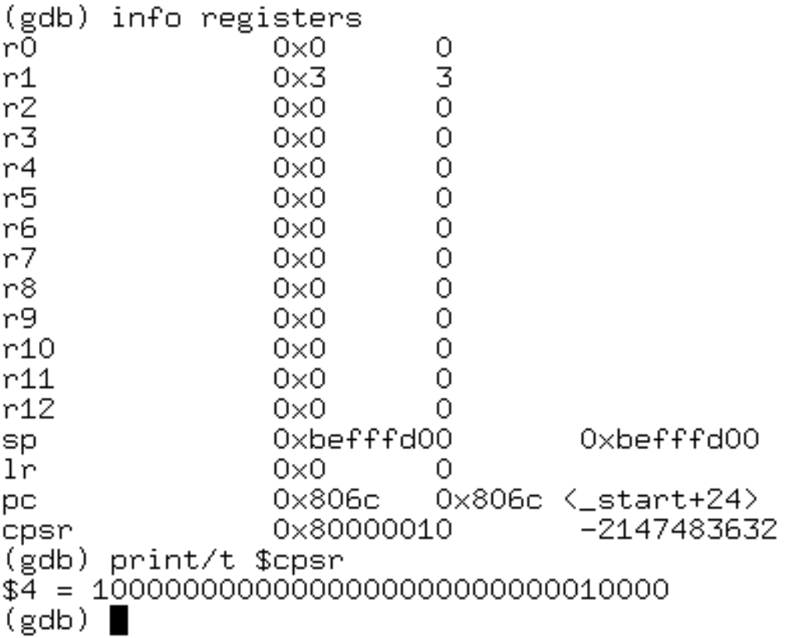

# El depurador GNU (gdb),
## es una herramienta muy útil. Aquí les voy a mostrar una o dos de sus características.

Es posible que necesite instalar gdb (en mi RPi, ejecutando Arch, el comando era: "pacman -S gdb"). Cuando lo haya hecho, puede usarlo para ver lo que está sucediendo mientras se ejecuta su programa. Esto puede ayudarlo a corregir algo que no funciona. Por ahora, sin embargo, veremos un programa de muestra que está funcionando correctamente.

Si desea utilizar gdb, debe invocar al ensamblador con algunas opciones adicionales. Agregar la funcionalidad gdb hace que su ejecutable sea más grande, por lo que no querrá hacer esto a menos que esté planeando una sesión gdb. El comando as se verá así:

```bash
as -gstabs -o nombrearchivo.o nombrearchivo.s
```

Bien, aquí está el programa de muestra que vamos a ver. ¡Es muy simple!


El depurador GNU (gdb) es una herramienta muy útil. Aquí les voy a mostrar una o dos de sus características.

Es posible que necesite instalar gdb (en mi RPi, ejecutando Arch, el comando era: "pacman -S gdb"). Cuando lo haya hecho, puede usarlo para ver lo que está sucediendo mientras se ejecuta su programa. Esto puede ayudarlo a corregir algo que no funciona. Por ahora, sin embargo, veremos un programa de muestra que está funcionando correctamente.

Si desea utilizar gdb, debe invocar al ensamblador con algunas opciones adicionales. Agregar la funcionalidad gdb hace que su ejecutable sea más grande, por lo que no querrá hacer esto a menos que esté planeando una sesión gdb. El comando as se verá así:

```bash
as -gstabs -o nombrearchivo.o nombrearchivo.s
```

Bien, aquí está el programa de muestra que vamos a ver. ¡Es muy simple!

**use_gdb.s**
```asm
@ use_gdb.s
@ demo program
.section	.data
.section	.text
.globl		_start
_start:
mov r1, $5	@ load r1 with 5
cmp r1, $4	@ compare r1 with 4
sub r1, r1, $1	@ subtract 1 
cmp r1, $4      @ r1 now DOES equal 4
sub r1, r1, $1
cmp r1, $4

mov r7, $1	@ exit syscall
svc $0		@ wake kernel
.end
```



Cuando gdb se inicia, necesitamos establecer un punto de interrupción. La ejecución del programa se detendrá allí y podremos avanzar una instrucción a la vez desde ese punto. Aquí, estoy estableciendo el punto de interrupción en la etiqueta _start.

```
(gdb) break *_start
(gdb) run
```

Después de haber dado el comando de ejecución, gdb ejecutará las operaciones hasta el punto de interrupción y esperará instrucciones. En este ejemplo, escribí "siguiente" dos veces para que se ejecuten las siguientes dos instrucciones. Luego escribí "registros de información" para ver el contenido de mis registros.


---


_Como puede ver, r1 tiene el valor 5. El puntero de la pila tiene una dirección en la memoria y el contador del programa muestra dónde estamos en el programa._

El otro registro que me interesa es **"cpsr"**, este es el registro de estado del programa que muestra qué banderas se han establecido. En este punto, su contenido no es muy interesante ya que no hemos hecho ninguna comparación.

Después de una instrucción más, los registros se ven así:



Puede ver que el contador del programa muestra que hemos avanzado 4 bytes (cada instrucción tiene 4 bytes). Además, el registro de estado del programa muestra el resultado de comparar r1 con 4.

Si seguimos un par de instrucciones, llegamos a esta posición.





Ahora r1 tiene 4 y se ha establecido el indicador "cero" en el **cpsr**. Esto se debe a que **"cmp"** en realidad hace una resta y luego establece las banderas en consecuencia. Dado que 4 - 4 = 0, se establece la bandera __cero.__

Si avanzamos una vez más, llegamos a esta posición.




Ahora estamos casi al final del programa, r1 ya no es igual a 4 y, por lo tanto, la última instrucción "cmp" ha provocado que la bandera de cero no esté establecida.

Ese es el final de este breve vistazo a **gdb**.


# 💯 Rúbrica ✍️
| Ponderación 	| Rubrica                                                                                                                                	|
|-------------	|----------------------------------------------------------------------------------------------------------------------------------------	|
| 50%         	| Entrega los programas .S del readme y los que sometió a evaluación a DGB a un directorio "código" para darle orden a su repositorio.   	|
| 30%         	| Modifica el README.md a presentando la AFIRMACIÓN de los programas  que realizó, acompañados de "screenshots"                          	|
| 10%         	| Compila un programa de CPP a ejecutable, este lo DESENSAMBLA en DGB (u otro medio también es posible) obteniendo el código fuente (.S) 	|
| 10%         	| Código fuente (.S) tiene un encabezado las generales del programador                                                                  	|


